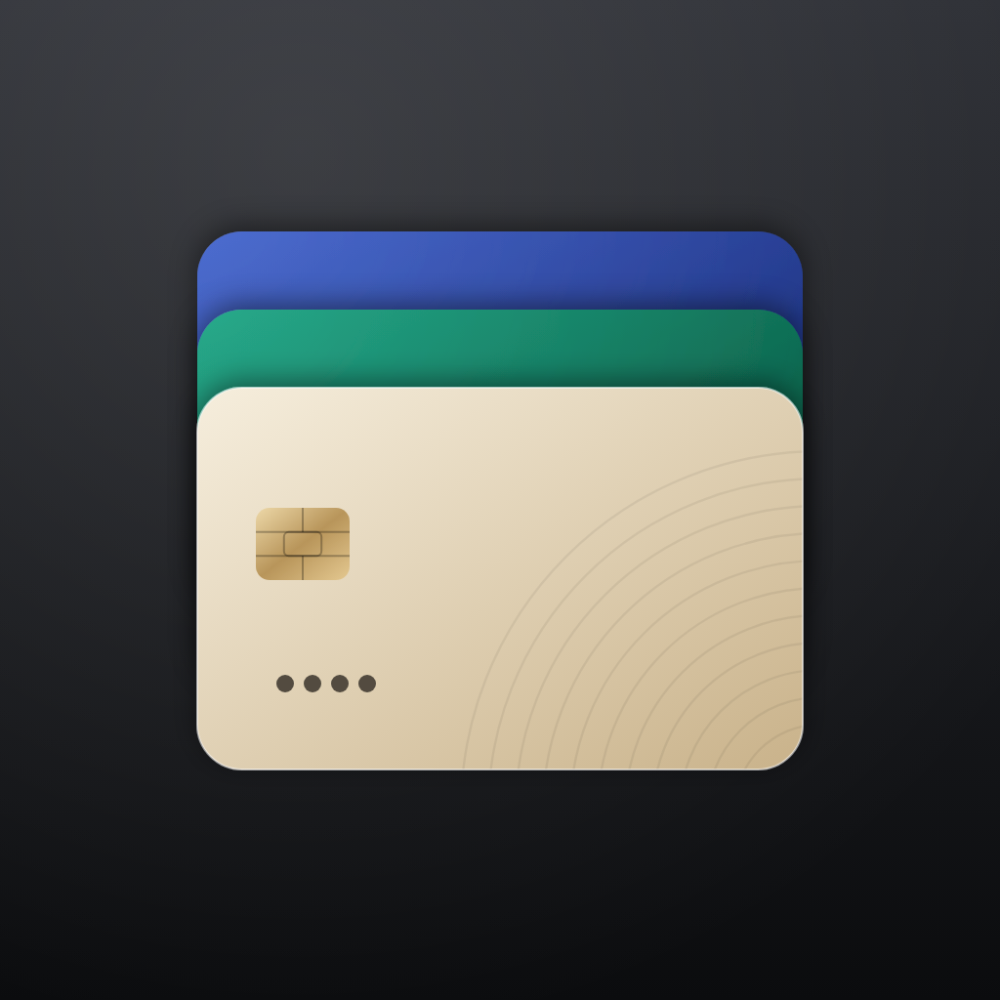

# Cardfolio

A small iPhone app for keeping track of the cards I carry. Design a card the
way it looks in real life, then drop it into Apple Wallet as a pass.

<p align="center"></p>

## What it does

- Make a card: nickname, issuer, type, network, last four digits, name on
  card, expiry and notes.
- Style it: ten palettes, your own two colours, and a plain, lines, rings or
  waves texture. The preview updates as you type.
- Browse your cards in a Wallet-style stack. Tap one for the details.
- Add it to Apple Wallet. The pass uses the card's colours, shows the name,
  last four, holder and expiry, and keeps your notes on the back.

Only the last four digits are stored, and everything stays on the phone.

### A note on Apple Pay

These are Wallet *passes*, not payment cards. Apple only lets a card's own
bank put a payable card into Apple Pay, so a Cardfolio pass is a good-looking
reminder of a card you have, not a way to pay with it.

## Running it on your iPhone

You need a Mac with Xcode 16 or newer, an iPhone on iOS 17 or newer, and a
paid [Apple Developer Program](https://developer.apple.com/programs/)
membership. Wallet refuses unsigned passes, and only paid accounts can create
the Pass Type ID certificate that signs them.

### 1. Create a Pass Type ID and its certificate

1. Go to [Certificates, Identifiers & Profiles](https://developer.apple.com/account/resources/identifiers/list/passTypeId)
   → Identifiers → **+** → **Pass Type IDs**, and register one, e.g.
   `pass.dev.pratikpatil.cardfolio`.
2. On the Mac, open Keychain Access → Certificate Assistant → *Request a
   Certificate From a Certificate Authority…*, fill in your email, choose
   *Saved to disk*.
3. Back on the portal, open the Pass Type ID → **Create Certificate**, upload
   that request and download `pass.cer`. Double-click it to add it to your
   keychain.
4. In Keychain Access → My Certificates, right-click
   *Pass Type ID: pass.dev.pratikpatil.cardfolio* → **Export** as a `.p12`
   and set a password.
5. AirDrop the `.p12` to your iPhone, or drop it in iCloud Drive.

<details>
<summary>No Mac handy for steps 2–4? OpenSSL works too.</summary>

```sh
openssl req -new -newkey rsa:2048 -nodes -keyout pass.key -out pass.csr \
  -subj "/emailAddress=you@example.com/CN=Cardfolio/C=IE"
# upload pass.csr, download pass.cer, then:
openssl x509 -inform DER -in pass.cer -out pass.pem
openssl pkcs12 -export -legacy -inkey pass.key -in pass.pem -out pass.p12
```

Keep `pass.key` and `pass.p12` out of git. The `.gitignore` already does.
</details>

### 2. Install the app

1. Open `Cardfolio.xcodeproj`.
2. Select the Cardfolio target → Signing & Capabilities → pick your team. If
   the bundle ID `dev.pratikpatil.cardfolio` is taken, change it to anything
   unique.
3. Plug in the iPhone, turn on Developer Mode (Settings → Privacy & Security
   → Developer Mode) and press Run.

### 3. Hook up signing

In the app, tap the gear → **Import Certificate…**, pick the `.p12` and enter
its password. The app reads the pass type and team from the certificate and
keeps it in the keychain. You only do this once a year, when the certificate
expires.

Now add a card, open it and tap **Add to Apple Wallet**.

## How it's put together

```
Cardfolio/                 SwiftUI app (iOS 17, SwiftData)
  Model/                   Card model, palettes, kinds and networks
  Views/                   Card face, stack, editor, detail, settings
  Wallet/                  Card → pass mapping, keychain, Wallet UI
Packages/WalletPass/       pass.json model, zip writer, signing, packaging
```

Passes are built and signed on the device. `WalletPass` writes `pass.json`,
hashes every file into `manifest.json`, signs the manifest with the Pass Type
ID certificate (detached PKCS #7, with Apple's WWDR G4 intermediate) using
[swift-certificates](https://github.com/apple/swift-certificates), and zips the
lot into a `.pkpass`. No server involved.

The package builds and tests on Linux as well as macOS:

```sh
swift test --package-path Packages/WalletPass
```
